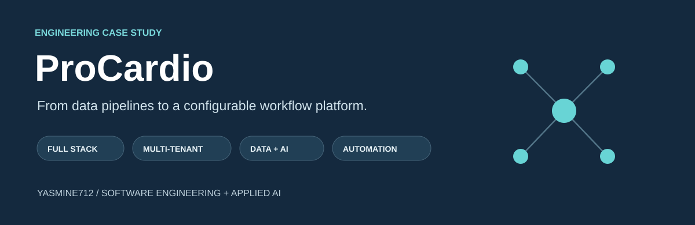
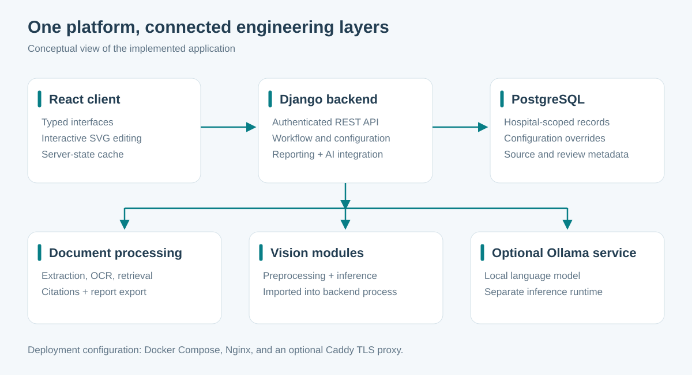

# ProCardio

**A configurable cardiology workflow platform, from structured data entry to interactive review and report generation.**

Engineering case study by [Yasmine Yassine](https://github.com/YASMINE712). ProCardio brings together a React interface, a Django API, hospital-specific configuration, document retrieval, speech transcription, and an image-analysis pipeline.

This repository explains the engineering through diagrams, design decisions, and abstract pseudocode. The application source, clinical questionnaires, medical rules, report templates, records, datasets, and model weights remain private.

## What the project demonstrates

| Area | Engineering work |
| --- | --- |
| Full-stack development | Typed React interfaces, REST APIs, relational persistence, authentication, and role-aware workflows |
| Multi-tenant design | Hospital-scoped requests, shared configuration, local overrides, and separate platform administration |
| Data engineering | Dataset conversion, annotation normalization, group-based splits, and training-data exports |
| Computer vision | PyTorch / Ultralytics training, augmentation, segmentation, and reviewable model suggestions |
| RAG and NLP | Document ingestion, OCR fallback, chunk retrieval, source citations, local language-model integration, and transcription |
| Workflow automation | Configuration-driven screens, structured drafts, derived summaries, and PDF/DOCX generation |
| Deployment | Docker images and Compose orchestration, with database, model service, and reverse-proxy configuration |

## Three engineering problems behind the interface

**One application, different hospital workflows.** Global defaults and hospital-specific overrides control how the interface is organized. The engineering challenge is to keep navigation, validation, and report inclusion consistent as configuration changes.

**Turning heterogeneous inputs into usable data.** Image annotations, sampled video frames, uploaded documents, and dictated text need different preparation pipelines. Preserving source information matters as much as producing a model input.

**Making automated output reviewable.** Model suggestions and retrieved passages need context. The interface presents results for review, while structured reporting reuses recorded information across output formats.

## Architecture

The web application uses a React client and a Django backend with PostgreSQL. Image-analysis code is imported into the backend process; Ollama is a separate optional service for local language-model inference. The diagram simplifies internal modules and omits clinical schemas.

## Explore the engineering

**For a quick review:** start with [project value](docs/project-value.md), follow [one request through the system](docs/request-walkthrough.md), then explore the [data and model pipeline](docs/data-and-ml.md).

| Read | What it explains |
| --- | --- |
| [Technology choices](docs/technology-choices.md) | What each technology does and the tradeoff it introduces |
| [Multi-tenant isolation](docs/multi-tenant-design.md) | How hospital context, permissions, and scoped data access fit together |
| [One request, end to end](docs/request-walkthrough.md) | Authentication, authorization, tenant scoping, persistence, and UI refresh |
| [Project value](docs/project-value.md) | How technical choices support users and what they demonstrate to an employer |
| [Data and computer-vision pipelines](docs/data-and-ml.md) | ETL, splitting, augmentation, training, evaluation, and inference |
| [RAG and workflow automation](docs/rag-and-automation.md) | Ingestion, retrieval, citations, transcription, and reporting |
| [Architecture and delivery](docs/architecture-and-delivery.md) | Application boundaries, containers, and the CI/CD extension design |
| [Automated showcase checks](docs/showcase-automation.md) | A real GitHub Actions workflow for the public documentation and diagrams |
| [Pseudocode walkthroughs](pseudocode/README.md) | Generic algorithms without application code or medical content |
| [Selected interface views](docs/interface-gallery.md) | A focused capture plan for the most informative screens |

## Technology stack

**Application:** Python, Django, Django REST Framework, PostgreSQL, JWT, React, TypeScript, Vite, TanStack Query, React Router, Axios, Tailwind CSS.

**Data and AI:** PyTorch, Ultralytics YOLO, OpenCV, segmentation refinement integrations, faster-whisper / Transformers, Ollama, PDF extraction and OCR.

**Reporting and delivery:** PyMuPDF, python-docx, SVG, Docker, Docker Compose, Nginx, and an optional Caddy TLS proxy. Existing application tests use Django's test framework and Vitest.

The main vision pipeline uses **PyTorch**. TensorFlow is not presented as an application dependency. Current document retrieval uses lexical and metadata scoring with an optional local LLM; embedding search is an extension opportunity. Container definitions are available, while an end-to-end automated application deployment is not claimed here.

## What I would extend next

1. Publish reproducible data-pipeline evidence: input/output counts, rejected records, split checks, and artifact fingerprints.
2. Evaluate retrieval with a fixed question set, expected sources, citation checks, and measured latency.
3. Connect automated checks, container builds, staging smoke tests, and release approval into a demonstrated delivery pipeline.

These extensions are useful because they turn architecture claims into results a reviewer can inspect. They are distinguished from the existing application throughout this case study.

---

[GitHub profile](https://github.com/YASMINE712) · [Portfolio](https://yasmine712.github.io/YASMINE712/)
