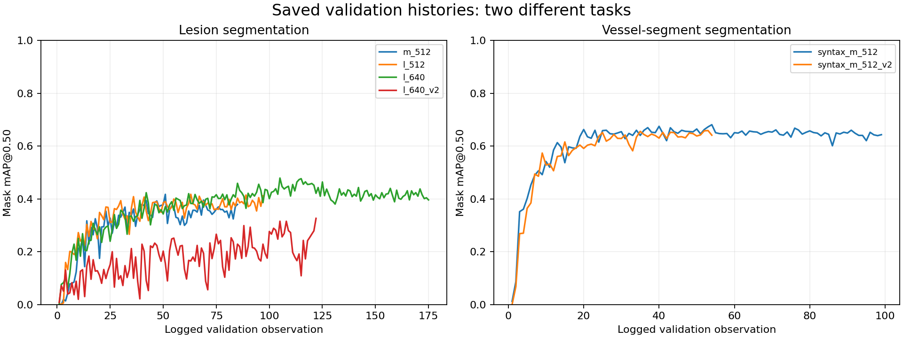

# ProCardio

**One connected workspace for interventional cardiology: guided procedures, interactive anatomy, reviewable AI and generated reports.**

Built by [Yasmine Yassine](https://github.com/YASMINE712), ProCardio brings full-stack development, multi-tenant architecture, data engineering and applied AI into one product. Its central idea is simple: information entered during a procedure should remain useful through review, reporting and service oversight.

This public showcase presents selected screens, a demonstration report, architecture diagrams, measured validation results and abstract pseudocode. Application source, questionnaire definitions, clinical rules, report HTML templates, datasets and model weights remain private.

## See the product

### Turn visual work into structured information

The coronary editor connects anatomy, annotations and contextual fields in one workspace. That structured state can support review and appear in the generated report, giving the interface value beyond a static drawing.

### Give teams a shared operational view

Hospital dashboards bring activity, validation queues and service indicators together. Shared defaults and hospital-specific configuration make adaptation across organizations part of the platform design. The displayed counts are demo data.

### Make AI suggestions actionable

ProIA presents structured prefill suggestions with accept, edit and reject actions. Alongside this intake workflow, the project includes document retrieval with citations, transcription and an image-analysis pipeline. These are distinct capabilities with their own data flows and evaluation needs.

**[Explore all eight screenshots](docs/interface-gallery.md) | [Open the generated PDF report](examples/procardio-demo-report.pdf) | [Explore deep-learning results](docs/deep-learning-evaluation.md)**

## Why this product matters

| Product opportunity | What ProCardio brings |
| --- | --- |
| Reduce repeated documentation work | Reuse structured procedure information across views and generated documents |
| Support different hospital workflows | Shared configuration with local overrides and hospital-scoped access |
| Make complex entry easier to navigate | A phased procedure journey, interactive anatomy and contextual controls |
| Keep clinicians involved in automation | Explicit review of suggested structured values |
| Connect care workflows to operational visibility | Service dashboards and report-validation queues |
| Build a foundation for applied AI | Dataset ETL, augmentation, model experiments, inference integration and feedback capture |

The opportunity is a configurable workflow platform that can support multiple hospital contexts through one application. These are product mechanisms and intended benefits; reduced documentation time, customer adoption and commercial returns remain outcomes to establish through pilots.

## Deep learning with inspectable results

The private training workspace contains recorded segmentation experiments, not only an architectural proposal. The strongest recorded lesion run in the selected logs reaches **0.47929 validation mask mAP@0.50**. The vessel-segment run referenced by inference reaches **0.65907** on its different segmentation task. Neither value is clinical diagnostic accuracy or a verified score for the complete deployed pipeline.

The [deep-learning walkthrough](docs/deep-learning-evaluation.md) explains data preparation, augmentation, model stages, exact precision/recall/mAP results, log provenance and the distinction between completed validation histories and evaluation code awaiting a completed result report.

## Architecture

The web application uses a React client and a Django backend with PostgreSQL. Image-analysis code is imported into the backend process; Ollama is a separate optional service for local language-model inference. The diagram simplifies internal modules and omits clinical schemas.

## Explore the engineering

**For a quick review:** start with [project value](docs/project-value.md), follow [one request through the system](docs/request-walkthrough.md), then explore the [data and model pipeline](docs/data-and-ml.md).

| Read | What it explains |
| --- | --- |
| [Technology choices](docs/technology-choices.md) | What each technology does and the tradeoff it introduces |
| [Multi-tenant isolation](docs/multi-tenant-design.md) | How hospital context, permissions, and scoped data access fit together |
| [One request, end to end](docs/request-walkthrough.md) | Authentication, authorization, tenant scoping, persistence, and UI refresh |
| [Project value](docs/project-value.md) | How technical choices support users and what they demonstrate to an employer |
| [Data and computer-vision pipelines](docs/data-and-ml.md) | ETL, splitting, augmentation, training, evaluation, and inference |
| [RAG and workflow automation](docs/rag-and-automation.md) | Ingestion, retrieval, citations, transcription, and reporting |
| [Architecture and delivery](docs/architecture-and-delivery.md) | Application boundaries, containers, and the CI/CD extension design |
| [Automated showcase checks](docs/showcase-automation.md) | A real GitHub Actions workflow for the public documentation and diagrams |
| [Pseudocode walkthroughs](pseudocode/README.md) | Generic algorithms without application code or medical content |
| [Selected interface views](docs/interface-gallery.md) | Eight original screenshots and a generated demonstration report |

## Technology stack

**Application:** Python, Django, Django REST Framework, PostgreSQL, JWT, React, TypeScript, Vite, TanStack Query, React Router, Axios, Tailwind CSS.

**Data and AI:** PyTorch, Ultralytics YOLO, OpenCV, segmentation refinement integrations, faster-whisper / Transformers, Ollama, PDF extraction and OCR.

**Reporting and delivery:** PyMuPDF, python-docx, SVG, Docker, Docker Compose, Nginx, and an optional Caddy TLS proxy. Existing application tests use Django's test framework and Vitest.

The main vision pipeline uses **PyTorch**. TensorFlow is not presented as an application dependency. Current document retrieval uses lexical and metadata scoring with an optional local LLM; embedding search is an extension opportunity. Container definitions are available, while an end-to-end automated application deployment is not claimed here.

## Limitations and next milestones

- **Data coverage limits model performance.** Correlated frames, annotation quality and differences between acquisition systems can affect generalization. Augmentation cannot replace independent examples or external validation. Recorded lesion recall and strict-IoU scores leave substantial room for improvement.
- **Validation is only one stage.** The published numbers come from saved validation logs. Completed held-out reports for the cited checkpoints, full-pipeline evaluation, prospective clinical performance and measured latency are not established here.
- **Feedback is not yet a retraining dataset.** Patient-linked review feedback cannot currently be reused for model training under the project's authorization. Acceptance or correction is not permission for a new data-processing purpose. The [data-governance note](docs/data-governance.md) explains the restriction, official CNDP references and the proposed authorized learning cycle.
- **Pilot evidence is the next product milestone.** Measure documentation time, report completion, user acceptance and cross-hospital configuration effort before claiming operational savings or scale.
- **Delivery can be extended.** Public documentation CI runs in GitHub Actions. Application containers exist; a demonstrated application CI/CD pipeline, release-linked model evaluation and a fixed RAG evaluation set are next engineering milestones.

The screenshots and PDF are selected demonstration artifacts. Interface wording is not evidence of hosting certification or regulatory approval.

---

[GitHub profile](https://github.com/YASMINE712) | [Portfolio](https://yasmine712.github.io/YASMINE712/)
