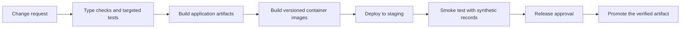

# Architecture and delivery

## Application boundaries

The frontend owns interaction, navigation, local editing state, and display of server data. The backend owns authenticated API access, persistence, configuration resolution, document processing, and report construction. PostgreSQL stores the relational application data.

The hospital context participates in request authorization and data filtering. Shared configuration and hospital overrides let one application support different layouts without maintaining a separate frontend for each organization.

Image-analysis modules run inside the backend process. Ollama is a separate optional service. Describing every Python module as a microservice would misrepresent the current design.

## Existing container configuration

The private application has separate backend and frontend Dockerfiles and a Compose configuration for the web services, PostgreSQL, and Ollama. The frontend image serves built assets through Nginx; an optional Caddy profile provides a TLS-proxy configuration. Model artifacts are mounted separately.

These files demonstrate packaging and service orchestration. A successful remote deployment, release history, and rollback exercise have not been established by this showcase.

## CI/CD extension design

The inspected application checkout does not contain a GitHub Actions workflow. The following is a proposed delivery flow, not a claim of an already-running deployment pipeline.

Application CI should operate in the private application repository. It needs an isolated test database, consistent runtime versions, synthetic fixtures, and no requirement to download medical data or large model checkpoints for ordinary checks.

Container builds should produce artifacts tied to a commit. Deployment should consume that tested artifact and record the running version. A release demonstration becomes credible when it includes a health check and a tested rollback path.

The public showcase has its own [automated documentation checks](showcase-automation.md). Their scope is the case-study files and diagrams; application CI and deployment remain the separate extension described above.

## Engineering tradeoffs to discuss

- A modular Django backend keeps workflow logic together, but synchronous inference can compete with ordinary requests.
- Dynamic configuration reduces repeated UI code, but changing configuration can affect existing records' presentation.
- Local model inference gives control over providers and runtime, but needs an explicit hardware and latency budget.
- Exporting both PDF and Word increases usefulness and introduces separate layout-verification work.
