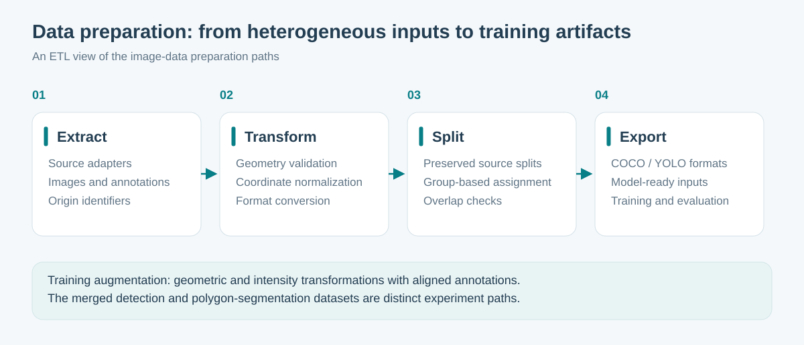
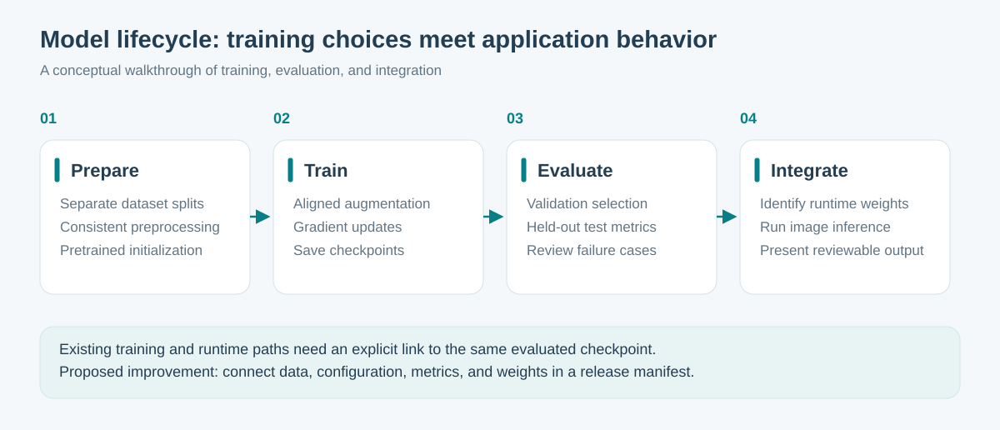

# Data engineering and computer vision

## Dataset preparation as an ETL pipeline

ProCardio's local training workspace contains adapters for heterogeneous image datasets and a builder that exports both COCO-style annotations and YOLO labels. It also contains a separate polygon-conversion path for segmentation training.

The merged detection-data path groups records by subject for sources with subject identifiers and checks for overlap between splits. Another source retains its provided split. This distinction matters: group-aware splitting in one adapter is not proof that every source has been independently checked for leakage.

Related video frames are correlated. The preparation code therefore treats sampled frames and their origin as linked records rather than unrelated images. A training-data expansion path propagates annotations to neighboring frames; those propagated labels remain a data-quality assumption to evaluate, not newly verified ground truth.

The merged detection dataset and the segmentation dataset are separate experiment paths. They should not be presented as one universal dataset used by every model.

## Augmentation and preprocessing

The segmentation training entrypoint configures rotation, translation, scaling, horizontal flipping, intensity variation, and instance copy-paste. It disables mosaic and vertical flipping in that recipe. These are experimental design choices, not a claim that every transformation is valid for every medical image.

Preprocessing includes local contrast enhancement. The training-data builder and inference entrypoint both contain this step, making preprocessing consistency part of the engineering work.

An informative experiment compares:

| Experiment | Question it answers |
| --- | --- |
| Baseline with minimal transformation | How well does the pretrained model adapt to the original data? |
| Geometric augmentation | Does robustness improve across position, scale, and viewpoint changes? |
| Intensity augmentation | Does performance hold under exposure variation? |
| Combined recipe | Are gains complementary, and what failure cases remain? |

This is an evaluation plan. No new ablation results are claimed in this repository.

## Training lifecycle

The training code supports pretrained initialization, selectable model size and input resolution, CPU/GPU selection, checkpoints, interrupted-run resume, and validation. It also contains a held-out test evaluation call. A training script containing an evaluation step is not evidence that a particular run completed it successfully.

Training and runtime currently use named checkpoint locations. A useful improvement is an explicit release manifest connecting the selected model to its data version, preprocessing, metrics, and inference configuration. That would prevent a newer training run from being confused with the checkpoint actually loaded by the application.

## What makes an experiment reproducible

| Artifact | What it connects | Why it matters |
| --- | --- | --- |
| Data manifest | Sources, transformations, and split membership | Explains which examples went into the experiment |
| Training configuration | Initialization, augmentation, resolution, and seed | Makes the experimental choices reviewable |
| Checkpoint identity | The saved weights and training run | Distinguishes evaluated weights from other experiments |
| Evaluation report | A checkpoint, a specific split, and a metric definition | Makes results interpretable instead of quoting an isolated score |
| Runtime configuration | The deployed checkpoint and preprocessing | Connects offline evaluation to what the application actually loads |

Training settings and checkpoints already exist in the private workspace. Joining these artifacts into a single traceable release record is the proposed improvement. The table defines the evidence to retain; it does not invent a completed model release.

## Inference and review

Images or video frames pass through preprocessing and model inference. Optional refinement and mapping stages add information to detected regions. The application exposes suggestions for review and records their origin, including demo fallback modes.

This demonstrates model integration and review-interface design. It does not establish autonomous diagnostic performance. Public results should identify the model, dataset split, evaluation protocol, and measured metrics before quoting accuracy or recall.

## Useful next evidence

- A small non-medical reproducibility example showing transformation, rejection handling, and split verification.
- A manifest containing record counts, a reproducible seed, dataset fingerprints, and artifact identifiers.
- An augmentation contact sheet with a fixed seed and a matching annotation overlay.
- A model card with measured precision, recall, localization metrics, inference latency, and representative errors.

None of these requires publishing the application's clinical datasets or model weights.
