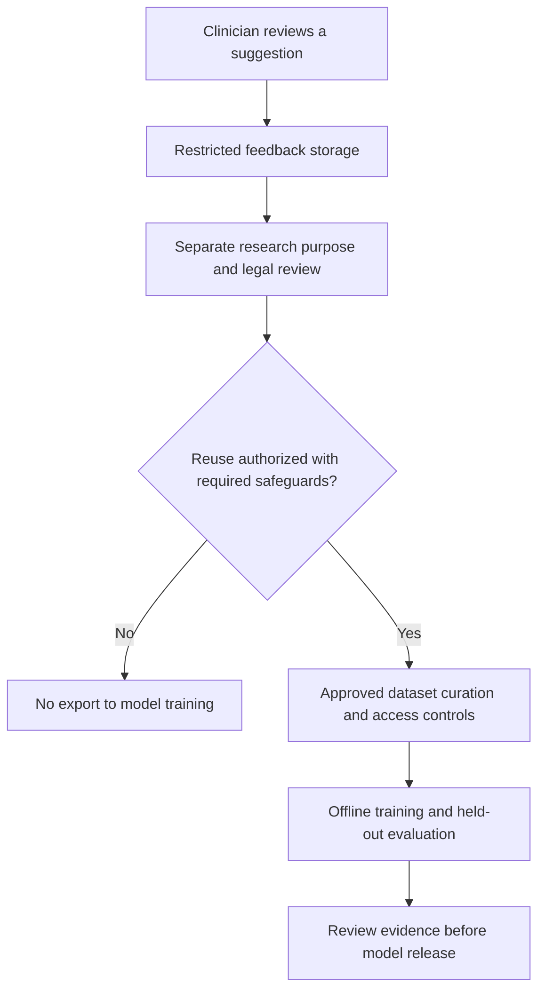

# Feedback, data access and responsible improvement

ProCardio records review decisions such as acceptance, editing and rejection. These decisions can reveal useful failure patterns, but they do not by themselves authorize reuse of patient-linked information for training.

**Current project boundary:** patient-linked feedback is not available for model retraining under the project's current authorization. The project owner identifies personal-data restrictions as a barrier to this reuse. Consequently, the showcase does not claim continuous learning from clinical use.

In the Moroccan context, CNDP guidance requires a defined processing purpose and applicable formalities, including authorization for sensitive health data and changes of purpose. A new research or training use therefore needs its own assessment and appropriate authorization; this is not a blanket claim that all medical-AI training is forbidden. See [CNDP processing conditions](https://www.cndp.ma/conditions/) and [notification procedures](https://www.cndp.ma/procedures-de-notification-process/).

## Proposed route to an authorized learning cycle

This is a governance design, not a claim that the application already enforces every gate. Existing export logic uses review completeness to determine training readiness; that technical flag is not a legal eligibility decision. A future implementation should keep those two states separate and prevent training exports without approved eligibility.

Removing names alone does not necessarily anonymize free text, medical images or linked records. Any authorized dataset needs an appropriate de-identification protocol, access restrictions, retention rules and documented provenance. The published demo screenshots and report do not grant permission to access or reuse real patient data.

Until that route is established, improvements can focus on permitted research datasets, evaluation methodology, interface feedback and non-identifying aggregate error analysis where authorized.
