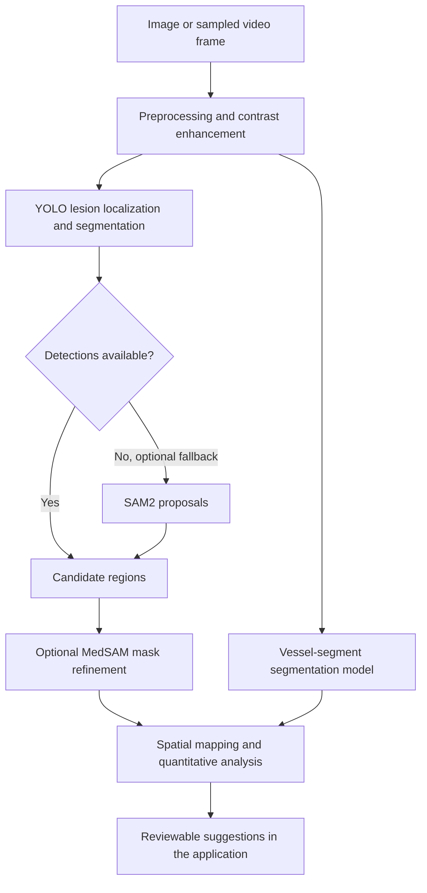

# Deep learning: from data to reviewed suggestions

ProCardio combines model experimentation with an application workflow: prepare angiography data, fine-tune segmentation models, retain validation histories, integrate inference, and present suggestions for review. The main framework is PyTorch with Ultralytics, not TensorFlow.

## Model and inference architecture

The inference module is imported into the Django process. It references `stenosis_seg/l_640/weights/best.pt` and `syntax_seg/syntax_m_512_v2/weights/best.pt`. Optional refinement stages depend on their available models and configuration. A training-log peak does not identify the exact weights selected by the framework's checkpoint fitness function.

## Data engineering and augmentation

The workspace includes ARCADE segmentation preparation and separate detection adapters for ARCADE, CADICA and ADSD. Source annotations are normalized into model-specific formats; segmentation polygons and detection boxes follow different preparation paths. Subject grouping is used where identifiers are available; source-provided splits are preserved elsewhere. This is not evidence of an independently verified patient-disjoint split for every source.

Current local ARCADE lesion-segmentation folder inventory (files, not unique patients; not a historical training manifest):

| Split | Image files | Label files |
| --- | ---: | ---: |
| train | 1000 | 1000 |
| val | 200 | 200 |
| test | 300 | 300 |

For the saved `l_640` run, the configuration records 640-pixel input, batch size 4, AdamW, seed 42, deterministic mode, a 300-epoch budget, patience 50 and resumed training. Its augmentation settings include 30-degree rotation, translation 0.08, scale 0.3, horizontal flip probability 0.5 and copy-paste 0.3; mosaic and vertical flipping are disabled. These are configured settings, not an augmentation ablation proving their individual benefit. Correlated neighboring frames and propagated labels require extra care during splitting and error analysis.

## What was evaluated

The table is derived from six saved Ultralytics `results.csv` files. For each run, select the row with the highest **validation mask mAP@0.50**, then take precision, recall and mAP@0.50:0.95 from that same row. Values are on a 0-1 scale. This is a descriptive comparison of recorded runs, not a controlled model benchmark.

| Run | Logged epoch at peak | Mask precision | Mask recall | Mask mAP@0.50 | Mask mAP@0.50:0.95 |
| --- | ---: | ---: | ---: | ---: | ---: |
| stenosis_seg/m_512 | 50 | 0.45723 | 0.46305 | 0.41760 | 0.13829 |
| stenosis_seg/l_512 | 61 | 0.45150 | 0.47537 | 0.41782 | 0.13388 |
| stenosis_seg/l_640 | 101 | 0.54239 | 0.49015 | 0.47929 | 0.15291 |
| stenosis_seg/l_640_v2 | 122 | 0.39373 | 0.42365 | 0.32660 | 0.10885 |
| syntax_seg/syntax_m_512 | 54 | 0.71607 | 0.67136 | 0.68130 | 0.28456 |
| syntax_seg/syntax_m_512_v2 | 53 | 0.74580 | 0.63669 | 0.65907 | 0.26266 |

The horizontal axis follows log-row order because resumed runs can repeat epoch numbers. The two panels represent different prediction tasks and should not be ranked against each other.

- **Precision** measures how often predicted positives match the evaluation targets; **recall** measures coverage of those targets at the evaluator's operating point.
- **Mask mAP@0.50** summarizes the precision-recall curve using mask intersection-over-union (IoU) of 0.50 for matching.
- **Mask mAP@0.50:0.95** averages across stricter IoU thresholds. Its lower values show that precise delineation remains harder than coarse localization.
- These numbers are **validation metrics**, not patient-level diagnostic accuracy, clinical sensitivity or prospective clinical validation.

The highest recorded lesion mask mAP@0.50 among these runs is **0.47929** (`l_640`), with recall **0.49015** and mAP@0.50:0.95 **0.15291** at that row. The vessel-segment run referenced by inference has a recorded peak of **0.65907** (`syntax_m_512_v2`). The earlier vessel-segment run peaks at **0.68130**; a newer run is not automatically a better model.

## Evaluation protocol and remaining evidence

The training and evaluation scripts support held-out test evaluation; no completed held-out result report was located for the cited checkpoints. Test-time augmentation support also does not establish a measured gain.

A separate joint evaluator matches lesion boxes at IoU >= 0.50 and checks the assigned vessel-segment class. Its reference class is inferred spatially from annotation polygons, rather than independently labelled for each lesion. This evaluator excludes SAM2 and MedSAM stages; no saved completed joint score was located. It must not be described as a full-system clinical evaluation.

## What the results teach us

The project demonstrates a complete engineering route from dataset adapters to a review interface. The next research gains depend on better data coverage, reliable annotations, leakage checks, controlled augmentation comparisons and external validation. Small or unrepresentative datasets can limit recall and generalization across acquisition systems, hospitals and patient populations; augmentation does not create independent clinical evidence. No causal claim about dataset size or augmentation is inferred from these six runs.

Reviewed patient feedback is not an automatically usable training set. See the [feedback and data-use boundary](data-governance.md) for the current restriction and a proposed authorized research workflow.

## Evidence provenance

Aggregates and a newly rendered chart are published; raw training logs, images and weights remain private. SHA-256 fingerprints identify the local log snapshots used to derive the table, but cannot independently reproduce results without access to those private inputs.

- `results/stenosis_seg/m_512/results.csv`: `88cbf0265f8685ab3c15e03195b2ed3aa8e960a5b0a8d848dadfba68c59d0ebc` (85 logged rows).
- `results/stenosis_seg/l_512/results.csv`: `bc9a6a4a61df6876ad131e06432eb1e74e941c4a55d35e3046e069131556cc6b` (97 logged rows).
- `results/stenosis_seg/l_640/results.csv`: `845370b786542e232c58ffa618f2d5117a8f5a37cd7ae3c1309494bafabe9089` (175 logged rows).
- `results/stenosis_seg/l_640_v2/results.csv`: `49ba7f874b56da8cd6f0b802772b6939df4bdfed43dc01488be13a558af6cafa` (122 logged rows).
- `results/syntax_seg/syntax_m_512/results.csv`: `987c0ec454ec03cc4fd91bb4490bf9d161a719b0745bdab9b8e704596db98335` (99 logged rows).
- `results/syntax_seg/syntax_m_512_v2/results.csv`: `482cbea0b392711593b955b9d6f04fb9d5c2d3a2ae0e15d835ec818666bf741b` (54 logged rows).
