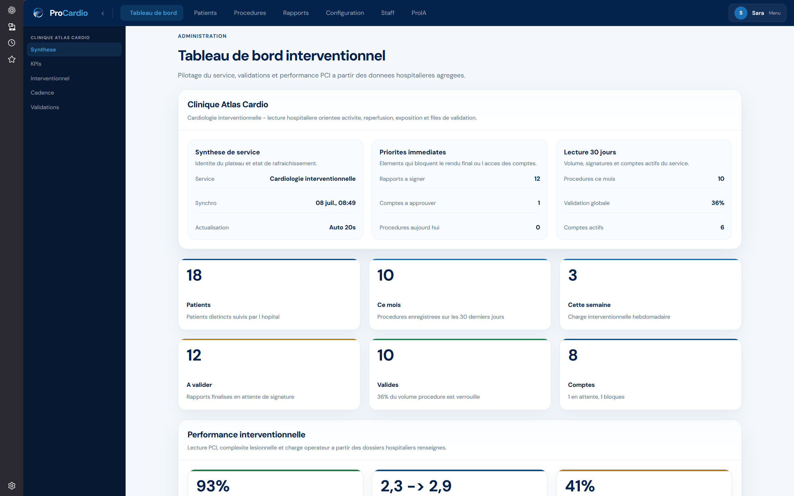
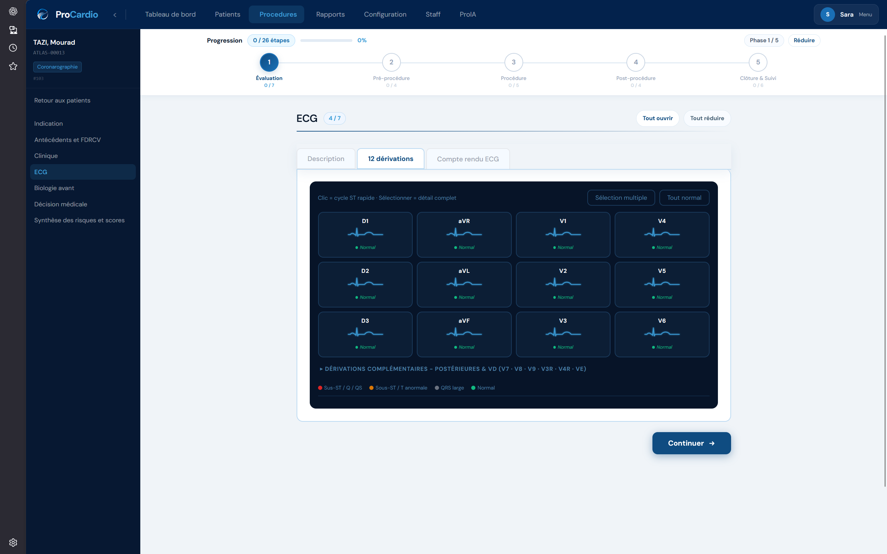
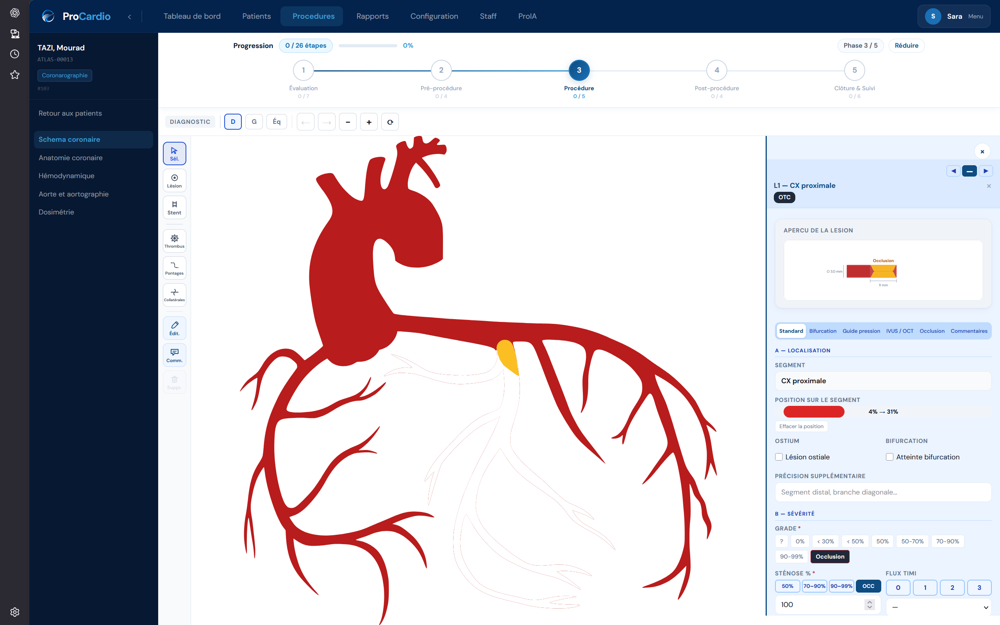
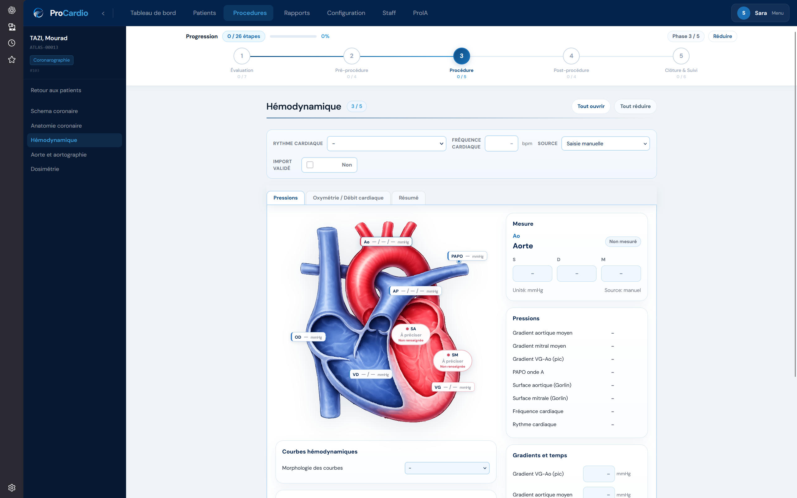
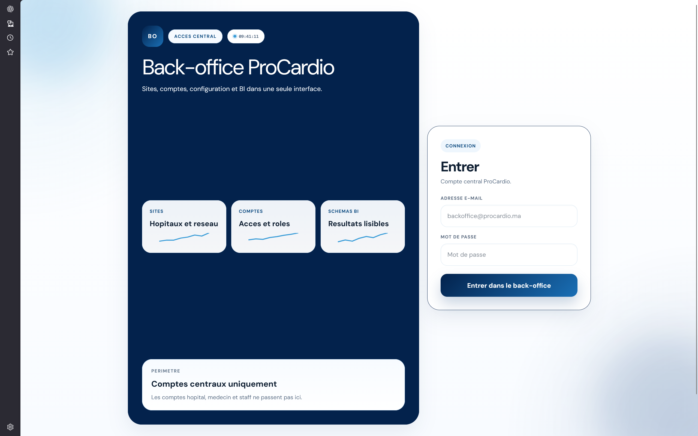
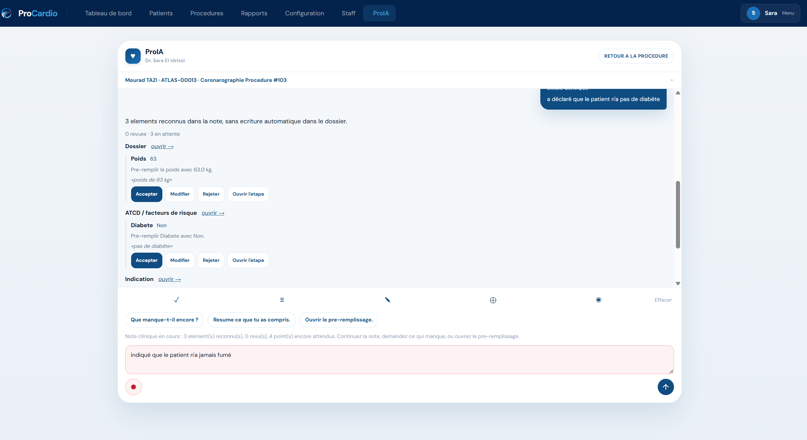
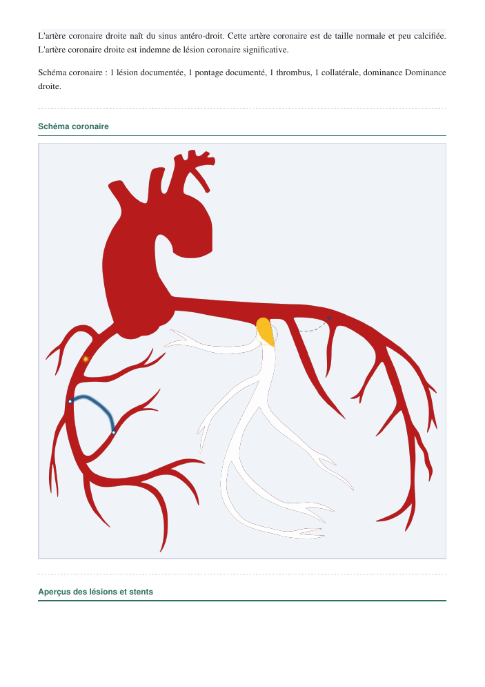

# Product gallery

Selected original screenshots are reproduced unchanged at the owner's request. The patient identifier ATLAS-00013 and the name shown correspond to a seeded demonstration identity in the application. Dashboard values illustrate the interface, not customer traction.

## A clear entry point

Hospital access with the ProCardio product identity.

## Hospital onboarding

An account request connects a user to a hospital and a professional role.

## Operational visibility

Activity, report-validation queues and service indicators in one hospital dashboard. Counts shown are demonstration data, not adoption metrics.

## Guided procedure workflow

A phased journey and an interactive lead view make structured entry easier to navigate.

## An interactive coronary workspace

Editable anatomy and a contextual side panel connect visual annotations to structured records.

## Anatomy-based data entry

A visual measurement interface brings anatomy, units and structured fields together.

## Separate platform administration

A dedicated central entry point supports site, account and configuration administration.

## AI assistance with human review

Structured intake suggestions can be accepted, edited or rejected. This screen demonstrates prefill review; it is not a screenshot of source-cited RAG or image segmentation.

## Generated report

[Open the original three-page demonstration PDF](../examples/procardio-demo-report.pdf). It combines structured narrative, a coronary diagram, lesion previews and a signature area. The file is unchanged; the image below is a rendered preview of page 2. Seeded values and blank or zero fields make this an output-format example, not a validated clinical document.

The registration screenshot includes hosting and health-standard wording from the interface. This showcase does not supply evidence of hosting certification or regulatory conformity.
