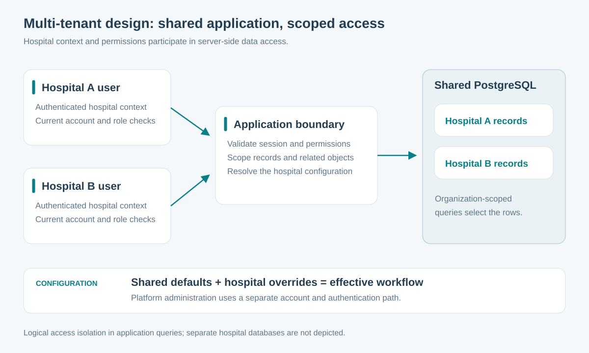
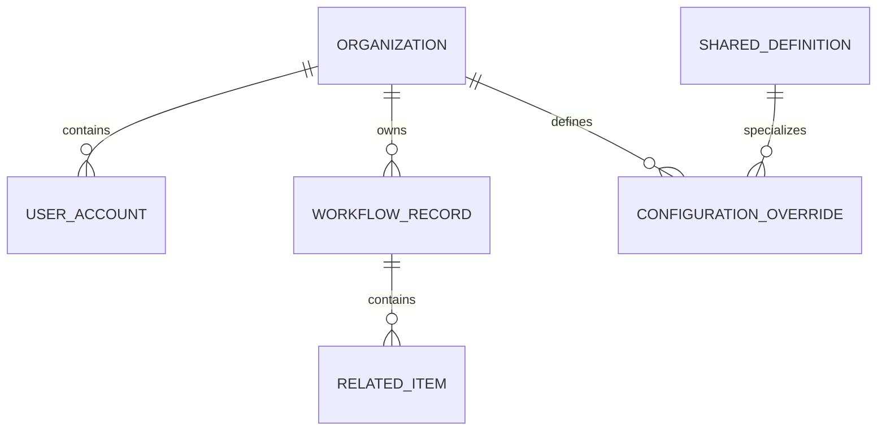
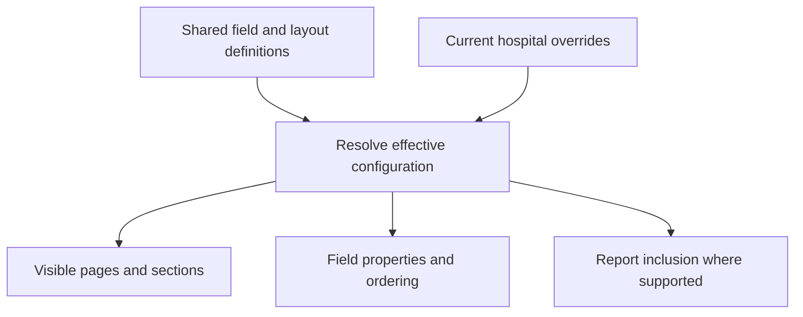

# Multi-tenant architecture

ProCardio uses one application with hospital-scoped records and configuration. Its data isolation model is a shared relational database with access constraints in the application layer.

## A request carries a hospital context

Authentication checks the signed token and resolves an active user and hospital. Where applicable, session and password-change checks can invalidate an existing login. The hospital context used by the inspected data endpoints comes from the authenticated token, rather than a freely chosen hospital identifier in an ordinary request body.

Record queries include the hospital scope. Nested objects are also accessed through their parent record's hospital. Role checks determine whether an authenticated user may perform a write.

The interface can hide unavailable actions, while the server performs the access checks. These responsibilities serve different purposes: a clear interface helps users, and scoped server queries enforce the data boundary.

## Two administrative levels

| Hospital administration | Platform administration |
| --- | --- |
| Works within a hospital's context | Manages platform-wide entities and selected hospital settings |
| Adjusts local workflow configuration | Maintains shared definitions and platform controls |
| Uses hospital account authentication | Uses a dedicated back-office account and authentication path |

This separation makes the operational roles explicit instead of treating every administrator as an unrestricted application user.

## Conceptual data relationships

This is a simplified teaching schema. It illustrates ownership and configuration relationships without reproducing the application's medical tables or field definitions.

## Shared defaults with local overrides

For a configurable property, a local override takes precedence when present; otherwise the shared value is used. Visibility, required status, ordering, and report inclusion have distinct meanings. Some workflow-level controls currently consume visibility only, so the scope of a configurable property depends on its consumer.

**Value:** one application can adapt to different organizations without copying the codebase. Shared improvements can be maintained centrally while local presentation choices remain configurable.

## An interview example

Consider two fictional organizations, Hospital A and Hospital B. Both use the same deployed application. A user authenticated for A requests a record identifier that belongs to B. A correctly scoped record lookup cannot retrieve it, because the lookup includes A's hospital context as well as the requested identifier.

The same principle must apply to related objects, attachments, reports, and administrative changes. Cross-tenant test cases should exercise each of those paths, including changed account membership and stale sessions. This case study describes the implemented design; it does not claim an independently verified isolation certification.

## Tradeoff

Application-level tenant scoping keeps the deployment and data model manageable. It also requires every relevant query and mutation to use the correct scope. Centralizing scope resolution and maintaining negative cross-tenant tests are valuable engineering extensions. Database-level row security or separate databases are different architectures and are not claimed here.
