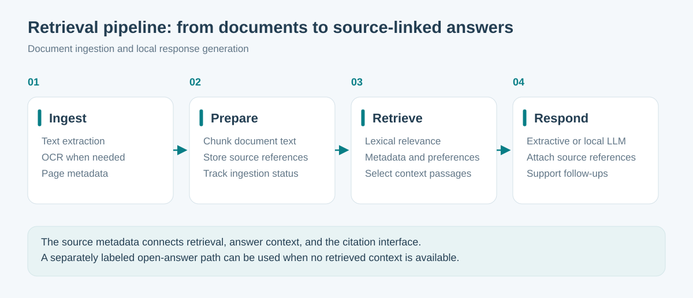
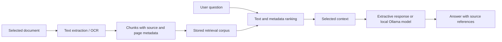
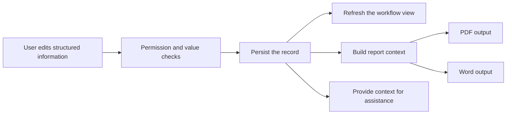

# RAG, language processing, and workflow automation

## From documents to cited answers

The document-ingestion flow accepts supported text sources, extracts text, attempts OCR when PDF text is insufficient, divides content into chunks, and stores page and source metadata. Re-ingestion replaces a source's stored chunks transactionally.

Current ranking uses lexical overlap, phrases, metadata, and source preferences. Citation follow-ups can favor the selected source or passage. The response layer supports extractive generation and an optional local model; an extractive fallback is available when local model generation fails.

The implementation also has an open-answer path for questions without retrieved matches when a local model is enabled. That path must be distinguished from a source-grounded answer. A useful extension is a measurable policy for answering, abstaining, or explicitly labeling unsupported responses.

## Why this is an engineering feature

The work extends beyond adding a chat box. It includes document lifecycle management, OCR failure handling, chunk metadata, relevance ranking, context selection, provider configuration, citation rendering, and follow-up behavior.

The current design favors a transparent retrieval baseline. Embedding retrieval and reranking could be compared against it if an evaluation shows a benefit; they are not listed as existing features.

## RAG evaluation to add

Use a fixed, non-medical evaluation corpus for a public demonstration. For each question, record the expected source, supported answer facts, and whether the system should decline to answer.

| Measure | What it tests |
| --- | --- |
| Recall at k | Whether a relevant source is retrieved in the first k results |
| Reciprocal rank | How early the first relevant source appears |
| Citation correctness | Whether the cited passage supports the answer |
| Unsupported-answer rate | Whether the system answers without sufficient evidence |
| Latency | Retrieval time separately from generation time |

A retrieval benchmark alone does not establish generated-answer faithfulness. Measure the latter with a separately defined answer-review procedure.

## Automation in the application

| Flow | Automated work | Human interaction |
| --- | --- | --- |
| Configurable workflow | Resolves screen structure from shared defaults and hospital settings | An administrator manages the configuration |
| Speech input | Transcribes audio and proposes structured information | The user reviews the transcription and proposed changes |
| Structured drafting | Assembles information already recorded in the workflow | The user reviews and edits the result |
| Report export | Builds output documents and graphics from structured content | The user inspects the exported document |
| Image analysis | Produces candidate findings with supporting visual context | The user accepts, edits, or rejects suggestions |

Report assembly and deterministic transformations are automation even when they do not call a language model. Keeping those responsibilities distinct makes the design easier to explain and evaluate.

## One edit, several useful outputs

The value comes from reusing the same structured information across the interface, assistant context, and reporting. This reduces the need to reconstruct a record separately for each output. The diagram expresses that data flow; it does not imply that all downstream documents regenerate automatically on every keystroke.
