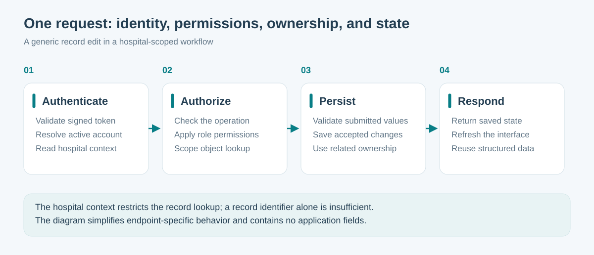
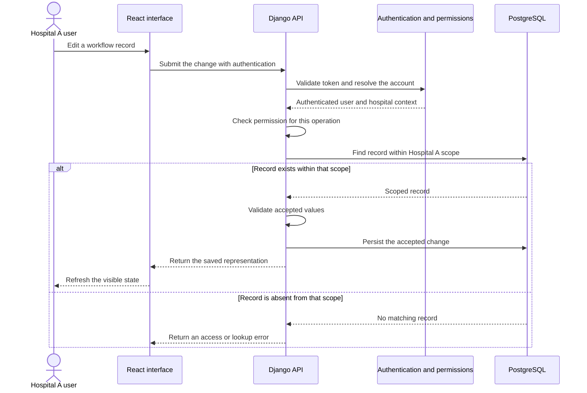

# One request, end to end

An employer can understand much of ProCardio's architecture by following a single edit. This walkthrough uses a fictional organization and a generic workflow record; it exposes no application fields or medical content.

## Example: editing an existing record

The sequence simplifies endpoint-specific details. It describes the application's separation of responsibilities rather than a literal API contract.

## Why each boundary matters

| Boundary | Engineering question | Value |
| --- | --- | --- |
| Authentication | Who is making the request, and is the account active? | Establishes an accountable application identity |
| Authorization | May that role perform this operation? | Separates access to information from permission to change it |
| Tenant scoping | Does the requested object belong to the authenticated hospital context? | Keeps ordinary hospital workflows within their organization |
| Validation | Are the submitted values accepted by this operation? | Gives persistence a defined input contract |
| Persistence and response | What was actually saved? | Lets the interface reconcile edits with server state |

For nested objects, the ownership check follows the parent record. Checking the parent is essential when a child object's identifier alone does not express its hospital context.

## Related design decisions

**Frontend state and server state have different jobs.** Local state supports editing and immediate interaction; the query cache represents fetched data. Mutation handling connects the two after a save.

**Configuration is part of the workflow.** Shared definitions and local overrides determine which controls are presented and how they are organized. Server permission checks remain a separate responsibility.

**Structured information can be reused.** Saved records can feed the report context, graphical views, and assistance features. Each consumer has its own trigger and review step; persistence does not imply that every export is regenerated immediately.

## A useful demonstration

Show a fictional Hospital A account opening one of its records, a role with restricted editing, and an attempted lookup outside A's scope. Explain the expected behavior before showing the result. This is a proposed demonstration scenario, not a claim that the entire authorization surface has been tested by the public repository.
