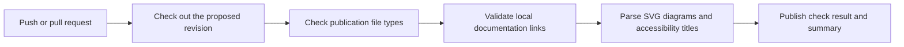

# Automated showcase checks

The public repository includes a [GitHub Actions workflow](../.github/workflows/showcase-checks.yml) that checks changes on pushes and pull requests. Its [run history](https://github.com/YASMINE712/procardio-showcase/actions/workflows/showcase-checks.yml) provides the execution evidence.

## What the workflow checks

- Tracked files belong to the documentation, diagram, or explicitly permitted workflow locations.
- Markdown links to local files resolve within the repository.
- Diagram files parse as SVG and include a title and view box.
- Text files decode as UTF-8 without replacement characters.
- SVG files contain no scripts, event handlers, embedded HTML, or linked external resources.

The workflow uses the runner's Python standard library for validation and a pinned revision of [GitHub's checkout action](https://github.com/actions/checkout). It requests read access to repository contents and does not retain checkout credentials.

## Scope of the result

A passing run means that these checks passed for this public case study. It does not evaluate the ProCardio application, validate medical behavior, check model performance, render Mermaid diagrams, or test deployment. The publication file check is an extension and location check, not a semantic detector for confidential content.

This gives the showcase an actual, inspectable automation loop while preserving a separate delivery plan for the private application.

## Selected media

An explicit path allowlist permits the eight selected screenshots, the original demonstration PDF, its rendered preview and the derived validation chart. CI checks their PNG/PDF signatures and a 10 MB per-file limit. These checks do not inspect privacy or clinical correctness; the selected assets were reviewed separately. Original screenshots and the supplied PDF were copied byte for byte.
